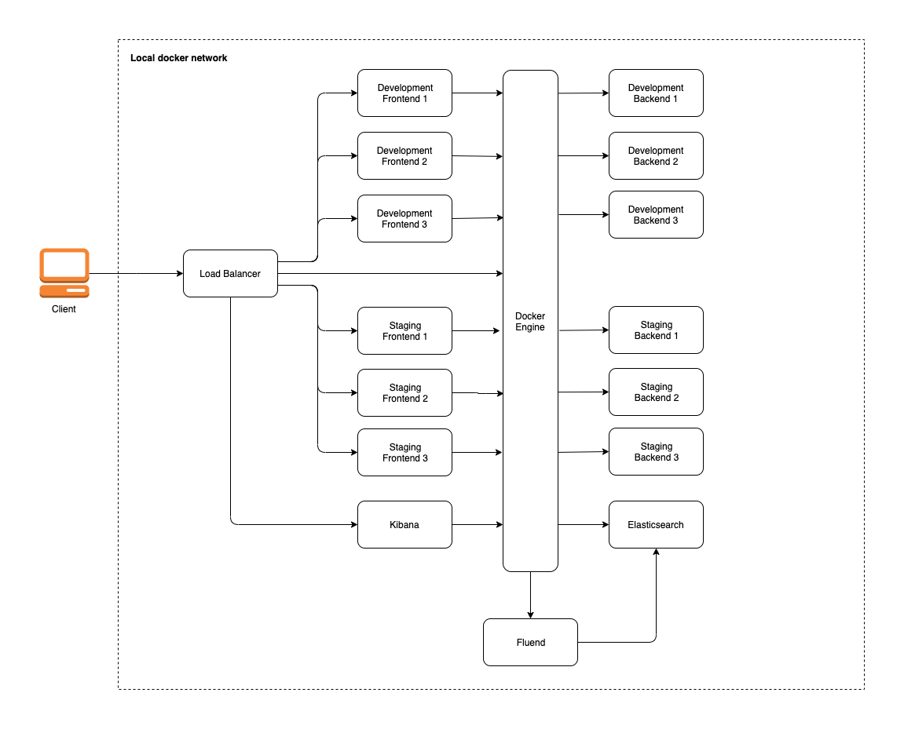

## Multi-environment scalable microservices system with centralized logging

Nginx to route all the incoming trafic.<br/>
Frontend and backend application with minimal codebase to demonstate application logging.<br/>
EFK stack for collecting, storing and visualizing logs.<br/>




## Environment


- Gateway
    - Debian 10
    - Nginx 1.17.5

- Applications
    - Ubuntu 16.04
    - GoLang 1.6.2

- EFK
    - Elasticsearch 6.3.0
    - Fluentd 1.2
    - Kibana 6.3.0

## Prerequisites

- Docker
- Docker-compose

##### Note: you should be able to run docker without sudo

## Installation

**Clone the project**
```
$ git clone https://github.com/aleksmark/centralized-demo.git
$ cd centralized-demo
```

**Build the docker environment**

By default nginx will start on port 80.
To run on custom port update port binding [here]( https://github.com/aleksmark/centralized-demo/blob/master/docker-compose.yml#L8) => "<CUSTOM_PORT>:80"

```
$ docker-compose up -d --build \
    --scale backend-development=3 \
    --scale frontend-development=3 \
    --scale backend-staging=3 \
    --scale frontend-staging=3
```

**Update hosts file (required to run with sudo user)**
```
$ echo "127.0.0.1 development.central.demo" >> /etc/hosts
$ echo "127.0.0.1 staging.central.demo" >> /etc/hosts
$ echo "127.0.0.1 kibana.central.demo" >> /etc/hosts
```

**Create index pattern**

Go to http://kibana.central.demo and follow the [documentation](https://www.elastic.co/guide/en/kibana/6.3/tutorial-define-index.html#tutorial-define-index) to create index pattern with name `fluend`

## Usage

Access the services on your local machine

http://development.central.demo<br/>
http://staging.central.demo<br/>
http://kibana.central.demo<br/>
